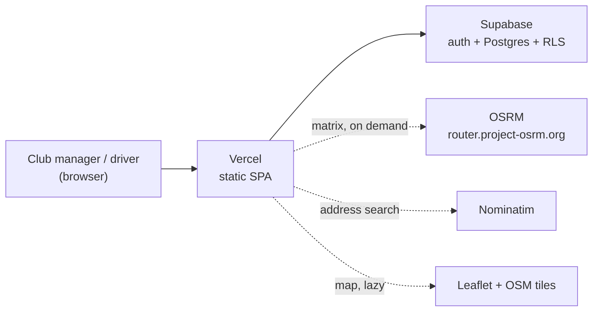
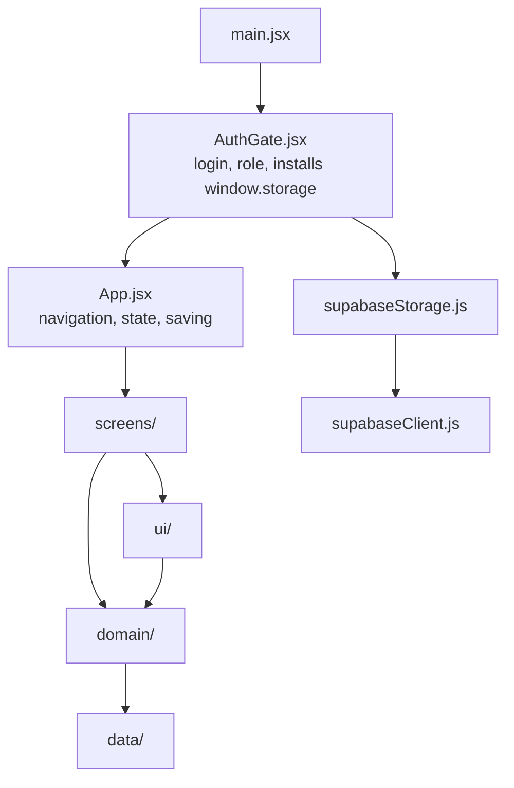
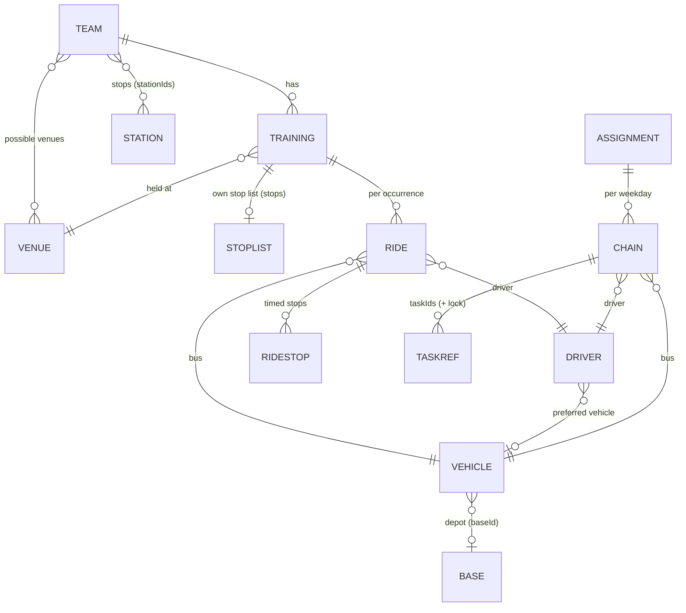
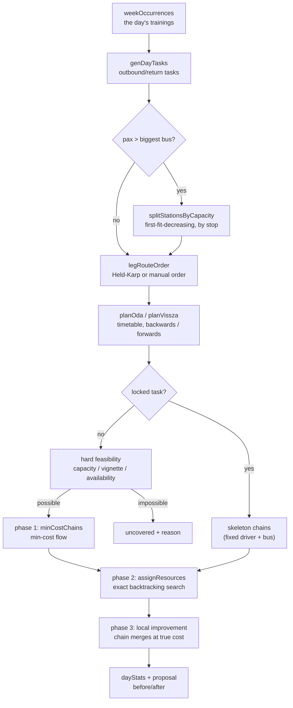

# Fuvarterv — architecture

This document describes **how Fuvarterv is put together**, and above all **why it is put
together that way**. Its purpose is that the codebase stays maintainable years from now:
whoever changes it should be able to see which rules hold the system together, and which
change would break which one.

| Document | What it answers |
|---|---|
| [`DEVELOPER.md`](DEVELOPER.md) | **How does it work?** A file-by-file, field-by-field reference. |
| **`ARCHITECTURE.md`** (this) | **Why is it built this way?** Layers, invariants, data flow, risks. |
| [`DECISIONS.md`](DECISIONS.md) | **What was decided, and what was the alternative?** The decision log. |
| [`MAINTENANCE.md`](MAINTENANCE.md) | **What do I do when I touch it?** Workflow, conventions, checklists. |
| [`ACTION_PLAN.md`](ACTION_PLAN.md) | **What is worth doing next?** Prioritised work from a code review. |

> **Language.** The user interface is Hungarian, because the club's staff and drivers
> use it. Everything else — code, comments, documentation — is English. Two Hungarian
> words survive as **stored data values** and cannot be translated without a data
> migration: a ride's direction (`oda` outbound, `vissza` return) and the driver role
> (`sofor`). A glossary is at the end of this document.

---

## Contents

1. [What the system solves](#1-what-the-system-solves)
2. [System context](#2-system-context)
3. [Governing design principles](#3-governing-design-principles)
4. [Layers and the module map](#4-layers-and-the-module-map)
5. [State and the save cycle](#5-state-and-the-save-cycle)
6. [Persistence and concurrency](#6-persistence-and-concurrency)
7. [Security architecture](#7-security-architecture)
8. [Domain model and invariants](#8-domain-model-and-invariants)
9. [The scheduling pipeline](#9-the-scheduling-pipeline)
10. [External services and degradation](#10-external-services-and-degradation)
11. [UI architecture](#11-ui-architecture)
12. [Performance and scaling limits](#12-performance-and-scaling-limits)
13. [Test architecture](#13-test-architecture)
14. [Extension scenarios](#14-extension-scenarios)
15. [Known risks and technical debt](#15-known-risks-and-technical-debt)
16. [Where to look when…](#where-to-look-when)
17. [Glossary](#glossary)

---

## 1. What the system solves

A rural handball club takes several youth teams to practice by minibus from the
surrounding villages. The problem is not planning one route. It is a **daily resource
schedule**: given fixed training times, pickup stops, headcounts, buses and drivers,
who drives which run, in which bus, and how can runs be chained back to back so the
day's wage bill comes out as low as possible.

Three consequences shape the entire architecture.

1. **The data is small; the logic is hard.** A few dozen entities, but an NP-hard
   scheduling core. So there is no backend, no database schema and no query language:
   the whole state is one JSON blob and the computation runs in the browser.
2. **The users are not computer people.** Club managers and drivers. So every failure
   branch has a sentence a human can act on, and every "could not do it" carries a
   reason. Silent skipping is forbidden (principle E7).
3. **In practice one person edits at a time.** So there is no real-time collaboration,
   but a **single-editor model with optimistic conflict detection**.

## 2. System context



Supabase is the only **required** dependency. The other three are enhancements, and
each has a visible fallback (principle E5).

## 3. Governing design principles

These eight are what a change **must not break**. Each says where it lives and what
happens if it is violated.

### E1. One state, one blob

The whole workspace is a single plain object (`teams`, `stations`, `venues`, `bases`,
`vehicles`, `drivers`, `trainings`, `rides`, `assignments`, `matrix`, `settings`) living
as JSON in one database row.

*Why:* atomic saves, trivial rollback, no server-side schema migrations, and every
derived view can be computed from one consistent snapshot.
*Cost:* no partial saves and no real-time co-editing.
*Where:* `src/data/storage.js`, `src/supabaseStorage.js`.

### E2. The domain is pure; side effects live at the edge

Functions in `src/domain/` and `src/data/seed.js` compute output from input. They do not
read `window`, do not call the network, and do not mutate shared state. Two exceptions
are deliberate and marked: `computeMatrix` (network) and the `window.storage` seam.

*Why:* it makes the hard part of the system testable without a browser, which is what
lets the optimizer be checked with property tests over randomly generated states.
*If broken:* tests like `optimizer.test.js` and `base-shift.test.js` could not be
written. That is the most valuable capability in the repo.

There is a third rule inside this one: **no `Math.random()` on a decision path.** The
optimizer must be deterministic, or the same day would produce a different schedule on
every click and nobody could trust it.

### E3. Dependencies flow one way

`App → screens → ui → domain → data`, never backwards. `domain/geo.js` is deliberately a
leaf module: both `logic` and `optimizer` use `legMin`, so keeping it inside either would
make the two circular.

*Where:* the import lists. This rule is **not machine-enforced today**, which is why it
is named explicitly here. See risk R4.

### E4. Fail-closed security

Anyone not entered as an admin is a driver, and a driver does not write. The prohibition
does not come from the UI; it comes from row level security. Hiding tabs is purely UX.

*Where:* `supabase/migrations/0001_initial_schema.sql`, `src/AuthGate.jsx` (`fetchRole`),
`src/App.jsx` (`isAdmin` guards, belt and braces, on the save path too).

### E5. Degrade, do not collapse

Every external dependency has a fallback path, and the fallback is **visible**: OSRM
falls back to a straight-line estimate (flagged in the matrix's `source` field), Leaflet
and tiles fall back to the built-in offline SVG picker, a point with no coordinate falls
back to `fallbackLegMin`, and a screen crash falls back to the `ErrorBoundary` inside the
shell, where snapshots and sign-out stay reachable.

### E6. "Not entered" is not "zero"

For a per-stop headcount, an empty field means *we do not know yet*; a typed `0` means
*no need to go there this time*. The data distinguishes them (`""` versus `0`), and
`genDayTasks`'s `zeroed()` predicate rests on that. `legPax` therefore returns the
**maximum** of the breakdown and the stated total: a half-filled breakdown must never
shrink a team.

*If broken:* children are left standing at a stop. That is the most expensive class of
failure this system has.

### E7. Silent skipping is forbidden

When a task cannot be built or cannot be covered, the system **says why**:
`genDayTasks().skipped`, `optimizeDay().uncovered[].reasons`, the chain `issues` from
`resolveDay()`, `contentionReasons`, and the `droppedChains` message for stale chains.
When you add a constraint, the explanation is not optional; it is part of the feature.

### E8. Old data must not change behaviour by itself

A new field's default in `ensureShape` must reproduce the **previous** behaviour. A
return leg with no `returnStationIds` mirrors the outbound one. A training with no
`stops` uses the team's list. A vehicle with no `baseId` falls back to the club depot,
and with no depot at all, paid time is measured exactly as it was before depots existed.

*Why:* there is no schema version and no server-side migration, so an upgrade must never
silently reprice a club's schedule.

## 4. Layers and the module map



| Layer | Modules | May import |
|---|---|---|
| `data` | `storage.js`, `seed.js`, `roles.js` | nothing from the app (`storage.js` is a true leaf) |
| `domain` | `constants`, `datetime`, `geo`, `logic`, `optimizer` | only `domain` and `data` |
| `ui` | `styles.css`, `base`, `OccCard`, `MapPicker`, `VignettePill`, `format` | `domain`, React |
| `screens` | Week, Schedule, Data, Teams, Master, StopListEditor, Ride, Driver, Users | `domain`, `data`, `ui` |
| shell | `App.jsx`, `AuthGate.jsx`, `ErrorBoundary`, `RestorePanel`, `supabase*` | everything above |

Inside `domain` the order is also strict: `constants → datetime → geo → logic →
optimizer`. There are no cycles.

The seam between the app and the shell is **event-based**, not an import: `App` fires
`fuvarterv:signout` and `fuvarterv:restore` on `window`, and `AuthGate` listens. That is
what lets `App` stay ignorant of authentication entirely.

## 5. State and the save cycle

There is no global store. `App.jsx` holds one `useState` containing the whole workspace,
passes it down as props, and exposes `update(fn)`, which must be a **pure** transform.

```
user edit
  → update((s) => ({ ...s, ... }))        pure transform
  → setState                              re-render, derived views recomputed
  → save effect: JSON.stringify(state)
  → equal to lastSaved?  yes → stop
                          no → 300 ms debounce → flush()
  → window.storage.set(...)
```

Three details matter and each prevents a real failure.

**`lastSaved` is compared as a string, not by object identity.** Otherwise every page
load would write back the state it just read, pushing the other editor into a "changed
elsewhere" conflict and burning the 20-slot save history on identical copies.

**The pending save is flushed on `pagehide`, on `visibilitychange`, and on unmount.**
Unmount is the sign-out case: `<App/>` goes away before the debounce would fire, and
without the flush the last edit would be silently dropped.

**A driver never schedules a save at all.** Row level security would reject it, but
attempting it would flash an error on every session, so the client does not try.

## 6. Persistence and concurrency

The app talks only to `window.storage`, a four-method key-value contract (`get`, `set`,
`delete`, `list`). `AuthGate` installs the Supabase-backed implementation at import time,
before `App` ever mounts; tests install a stub.

The model is **single-editor with an optimistic guard**:

1. `get` remembers the row's `updated_at` as `lastSeen`.
2. `set` updates only where `updated_at` still equals `lastSeen`.
3. Zero rows matched means somebody else wrote in between. The UI blocks and asks for a
   reload rather than overwriting.

Two refinements stop that guard from misfiring.

**Writes are serialised.** Each `set` chains onto the previous one, so `lastSeen` is
never read mid-flight by a second overlapping write. The chain is never left rejected, or
one failed save would block every later one.

**A lost response is told apart from a real conflict.** If the guard matches nothing, the
row is re-read: if the server already holds exactly what we last tried to write, that
write did commit and only its response was lost. We adopt the row's timestamp and retry,
rather than hard-blocking the workspace over our own success.

**History is best-effort.** On every successful overwrite the *previous* blob is archived
to `app_state_history` and pruned to 20. It is fire-and-forget and swallows its own
errors: a history failure must never fail a save. An unchanged blob is never archived —
filling 20 slots with identical copies would destroy exactly the restore points a user
goes looking for.

Restoring goes through the **normal guarded write**, so it cannot bypass the conflict
check, and then reloads the page.

## 7. Security architecture

**The boundary is row level security. The UI is only UX.** Every rule that matters is in
`supabase/migrations/0001_initial_schema.sql`.

- Reads are open to any authenticated user, because drivers must see the schedule.
- Writes are admin-only and scoped to the one workspace row.
- `is_admin()` is `security definer` with an empty `search_path`, so the `user_roles`
  policies that call it cannot recurse, and every name inside it is schema-qualified.
- There is no delete policy on `app_state`, and no update policy on the history.

**The one setting that is not in the schema file** is turning off public sign-ups. The
anon key ships in the JS bundle by design, and every policy grants access to any
*authenticated* user. While sign-ups are open, anyone who reads that key out of the
bundle can register and read everything. The schema file says so in its header, and so
does the README.

`vercel.json` adds a Content-Security-Policy with **no `'unsafe-inline'`**, listing
exactly the origins the app uses.

## 8. Domain model and invariants

### Entities



Field-level shapes are in [`DEVELOPER.md`](DEVELOPER.md#7-the-data-model-the-single-json-blob).
What matters here is what follows from the **relationships**.

### Stored, derived, and hybrid data

| Kind | Example | Where it comes from | Lifetime |
|---|---|---|---|
| Stored | team, station, vehicle, driver, training, ride, schedule | user editing | in the blob |
| Derived | occurrences (`weekOccurrences`), tasks (`genDayTasks`), chain view models (`mkChain`, `resolveDay`) | recomputed every render | memory |
| Hybrid | `matrix` (computed but stored), `assignments` (chains *reference* derived tasks) | computed, then saved | in the blob |

Hybrid data is the system's most delicate point, because **a stored reference points at a
recomputed object**:

- A **task id** has the shape `${trainingId}:${day|"x"}:${direction}${#index}`, so after a
  change to stops or headcounts a `...:vissza` id can become `...:vissza#1`. `resolveDay`
  does not drop stale chains silently: it counts them (`droppedChains`) and the UI says to
  re-run the optimizer. See risk R1.
- The **matrix key** (`matrixKey`) contains every located point's id and its coordinate
  rounded to five decimals. If it differs from the current one, the UI flags the matrix
  as stale.

### The invariants

These are rules the tests pin down. A change that violates one is introducing a bug, not
fixing one.

| # | Invariant | Where it lives | Test |
|---|---|---|---|
| I1 | With no override, the return leg mirrors the outbound one; nothing changes for an existing team | `legFor`, `teamLeg` | `return-leg.test.js` |
| I2 | A training's own stop list is a **complete** override; there is no half-inheritance by direction | `legSource` | `training-leg.test.js` |
| I3 | The headcount to carry is the maximum of the breakdown and the stated total | `legPax` | `fixes.test.js` |
| I4 | An explicit zero drops a stop from the route; an empty field does not | `genDayTasks.zeroed` | `zero-count-stops.test.js` |
| I5 | Every task lands in exactly one chain, or is uncovered with a reason | `minCostChains` (`seen`), `optimizeDay` | `optimizer.test.js` |
| I6 | A shared vehicle or driver must physically be able to get between two chains | `resourceClash`, `resolveDay` | `optimizer.test.js` |
| I7 | The call-out fee is per shift, not per chain | `driverPay` + `mergeShifts` | `base-shift.test.js` |
| I8 | Only a vignette-carrying vehicle may serve a vignette-only venue (a hard constraint) | `assignResources`, `optimizeDay` | `vignette.test.js` |
| I9 | A station, venue or depot cannot be saved without a coordinate | `MasterForm` | `master-coord.test.jsx` |
| I10 | Referenced master data cannot be deleted | `deleteGuard`, `chainRefs` | `fixes.test.js` |
| I11 | Sample data is never seeded over real data after a read failure | `isNotFound`, preflight | `load-error.test.js` |
| I12 | A saved ride's direction cannot be switched | `RideForm` | `ride-direction.test.jsx` |

## 9. The scheduling pipeline

This is the heart of the system, and the only place where the simple solution is not
good enough.

### The problem

Given a day's training occurrences, each produces an **outbound** and a **return** task
(possibly several, split by capacity). One driver-and-bus pair can run several tasks
back to back if it can get between them in time and space. The objective is the day's
**wage bill**:

```
cost  = Σ over shifts [ call-out fee + max(shift length, minimum shift) / 60 × hourly wage ]
shift = the union of touching depot-to-depot spans
```

That is resource-constrained scheduling, which is NP-hard. A single exact model would not
run in a browser, so the solution has **three phases**, each working on a more accurate
cost function than the last.



### The phases, and why they are shaped this way

**Task generation (`genDayTasks`).** One pass per direction, because the return leg can
have its own stops, its own headcounts and even its own bus count. From there the two
directions' tasks are **independent**: chaining works on time and deadhead, and nothing
forces part #1 to pair with part #1.

**Timetabling.** The outbound timetable is computed **backwards** from the target arrival
before the training starts (when must we leave to get there in time), and the return leg
**forwards** from the departure after it ends. This is the only correct direction: in both
cases the fixed point is the venue, not the stop.

**Route ordering (`bestStationOrder`).** Held-Karp dynamic programming over `2^n × n`
states, with an optional pinned first or last stop and the venue as a prefix or suffix.
**Exact up to 10 stops**; above that the original order is kept, because both memory and
time run away past that and real runs are not longer.

**Phase 1, chaining (`minCostChains`).** A bipartite graph: each task can be a predecessor
once and a successor once, and an edge `A → B` exists when
`A.end + deadhead(A.to, B.from) ≤ B.start`. The edge cost is:

```
edge(A→B) = (forced wait ? 0 : gap × average per-minute wage) − call-out fee
```

The negative term is the point: chaining **saves one call-out fee**, while the gap costs
paid time — unless the driver could not get home during the gap anyway, in which case the
waiting is paid with or without chaining and must not be charged against it. The algorithm
pushes flow along successive shortest paths, and **only along paths with negative total
cost**, so it chains exactly as long as chaining is cheaper. The loop is bounded at `n`
augmenting paths, and reading the chains back out uses a `seen` set so that even a
degenerate cycle in the succ/pred graph cannot make a task disappear.

**Phase 2, resource assignment (`assignResources`).** Backtracking search against the real
cost function, pruned on cost (`cost >= best.cost` backtracks). A chain's price is the
**increment** to that driver's cost for the day: attach it to an existing shift and only
the extra paid time counts, with no second call-out fee. The search stops after 30,000
iterations and **says so** (`capped` produces a "heuristic" note) rather than pretending
it found an optimum.

**Phase 3, local improvement.** Phase 1 only saw average wages and gaps. Minimum shift
lengths and differing wages are corrected here by trying to merge free chains and skeleton
chains, accepting a trial only when the whole plan's cost **strictly** decreases. At most
60 rounds.

### Hard and soft constraints

There is exactly one soft constraint: the **preferred-vehicle bias**, a forint penalty for
putting a driver on a bus other than their usual one. Everything else — capacity,
availability, the vignette, physical reachability — is hard.

The golden rule when adding either: a hard constraint needs a filter in `assignResources`
**and** a pre-filter in `optimizeDay`'s feasibility pass, with a reason (E7). A soft one
is a cost term, and it must also go into `skelCost`. Leaving it out of `skelCost` makes
the improvement loop compare a biased cost against an unbiased one, and the displayed
daily cost can then go **up** after optimising.

## 10. External services and degradation

| Service | Used for | Failure behaviour | Visible? |
|---|---|---|---|
| Supabase | auth, storage, roles | retry screen; never seeds over unread data | yes |
| OSRM | the deadhead matrix | haversine estimate at `estSpeedKmh` | yes, `matrix.source` |
| Nominatim | address search in the map picker | an error line; pick by hand or paste a coordinate | yes |
| Leaflet + OSM tiles | the map picker | the built-in offline SVG picker | yes |

The OSRM **demo server** is fine for testing and not for production. Replacing it is a
one-function change (`computeMatrix`). See risk R2.

## 11. UI architecture

**Props down, callbacks up.** No context except `RoleContext`, which carries exactly two
values (role and e-mail) and does not change while `App` is mounted.

**One stylesheet.** `src/ui/styles.css` defines every design token once and contains both
halves of the UI: `.shell-*` rules for the frames that run outside the app proper (login,
error boundary, restore panel, save-failure toast) and everything else for the app itself.
Tailwind utilities are used in the markup for **layout only**; colour, size, typography
and state belong in the stylesheet. Dark mode follows the operating system.

**Editor forms remount by `key`** rather than synchronising a draft by hand, which is what
keeps a half-filled form from being silently reset by a parent re-render.

**Components are defined at module level.** A component defined inside a render function
is a new type on every render and loses its state.

## 12. Performance and scaling limits

| Limit | Value | What happens at the limit | Where |
|---|---|---|---|
| Held-Karp exact routing | ≤ 10 stops | the original order is kept (no error, just not optimal) | `bestStationOrder` |
| Assignment search space | 30,000 iterations | best found so far, plus a "heuristic" note | `assignResources` |
| Local improvement | 60 rounds | stops, keeping the best plan so far | `optimizeDay` |
| Save history | 20 snapshots | the oldest falls off | `supabaseStorage` |
| Workspace size | one `jsonb` row | practically a few MB; beyond that the save round-trip slows | `app_state` |
| Re-rendering | the whole tree on every edit | imperceptible at club scale | `App.jsx` |

Optimisation is **synchronous** and takes from a fraction of a second up to about a second
and a half. The button therefore yields for one frame to paint its "calculating" state
first, or the browser would not repaint and the button would look dead. If it ever becomes
noticeably slow, the next step is not micro-optimisation but a Web Worker: `optimizeDay`
is a pure function and can simply move.

## 13. Test architecture

19 test files, 168 tests (`npm test`, Vitest and jsdom), in four layers.

| Layer | Example | What it protects |
|---|---|---|
| **Property tests** | `optimizer.test.js`, random states from a seeded PRNG | the scheduling invariants (I5, I6): every task gets a home, no physically impossible chain |
| **Domain unit tests** | `domain`, `return-leg`, `training-leg`, `vignette`, `zero-count-stops`, `base-shift` | rules and edge cases: plates, times, mirrored versus own return leg, zero headcounts, shift arithmetic |
| **Regression tests** | `fixes`, `load-error`, `settings` | **specific defects that actually happened.** Each one describes the wrong behaviour it rules out |
| **UI and integration tests** | `smoke` (mounts `<App/>` and walks every tab), `roles`, `login`, `master-coord`, `ride-direction`, `training-stops-ui`, `vignette-ui`, `base-visibility` | that every referenced identifier exists, and that the role, coordinate and direction rules hold on screen too |

Two structural choices:

- **Tests import from the real modules**, not through a barrel. A new domain function is
  testable immediately, with no export list to keep in sync.
- **The `window.storage` seam is filled with a stub**, so the full load-and-save cycle
  runs without Supabase.

What the suite does **not** cover: the real Supabase round trip (the RLS policies
themselves), the Leaflet path, and CSP behaviour under production headers. Those are
manual checkpoints — see [`MAINTENANCE.md`](MAINTENANCE.md).

## 14. Extension scenarios

### A new field on an entity

1. `ensureShape` — give it a default that reproduces the **previous** behaviour (E8).
2. `seedState` — fill it in the sample data if that is meaningful.
3. The form: a field in `MasterForm` / `TeamForm` / `TrainingForm`, plus normalisation on
   save.
4. If anything will reference it, extend `deleteGuard` (I10).
5. Does it affect the timetable or the cost? Then `optimizer.js`, and a test that pins
   down the old behaviour as well as the new.

### A new setting

`DEFAULT_SETTINGS` in `data/storage.js` → the settings modal in `ScheduleScreen` → use it
in the domain. `DEFAULT_SETTINGS` is the single source; both `seedState` and `ensureShape`
read from it so they cannot drift.

### A new optimizer constraint

1. Decide: **hard** (excluding) or **soft** (a cost term)?
2. Hard: a filter in `assignResources`'s options **and** a pre-filter in `optimizeDay`'s
   feasibility pass, with a reason (E7). The vignette is the worked example.
3. Soft: a cost term — and put it in `skelCost` too (see the golden rule in §9).
4. A property test for the new invariant.

### A different backend

Implement the four-method `window.storage` contract and install it in place of
`supabaseStorage`. Nothing in `src/domain/`, `src/ui/` or `src/screens/` changes.

## 15. Known risks and technical debt

An open list: not bugs, but accepted trade-offs and identified weak points. Anyone
touching the system should know about them. [`ACTION_PLAN.md`](ACTION_PLAN.md) says what
to do about each.

| # | Risk | Consequence | Mitigation / direction |
|---|---|---|---|
| R1 | **Task ids are not stable** (they contain the split index) | saved chains can drop out after stops or headcounts change | today: counted, with a user-facing message (`droppedChains`). Properly: a split-independent id plus a separate mapping |
| R2 | **The OSRM demo server** | an availability and accuracy risk in real use | self-hosted OSRM or a paid API; the swap point is one function (`computeMatrix`) |
| R3 | **One blob, single-editor model** | of two concurrent editors, the second is forced to reload | documented and visible. If a real need appears: per-entity rows plus CRDT or merge, which is a large step |
| R4 | **The layer rule is not machine-enforced** | circular imports can creep in over time | an import-boundary lint rule can be added |
| R5 | **`assignments` is a per-weekday template** | chains never cross days; scheduling one-off trainings is limited | a deliberate simplification; date-based scheduling needs a different model |
| R6 | **Duplicated feasibility check** | `taskHardIssues` in `ScheduleScreen` re-implements part of `optimizeDay`'s and has already drifted (it omits the vignette), so a task blocked only by that shows no reason — a violation of E7 | merge into one domain function. `ACTION_PLAN.md` P0-2 |
| R7 | **No server-side validation** | a broken client could save an invalid blob | `ensureShape` defends reads; the save history is the way back |
| R8 | **Whole-tree re-render** | noticeable slowdown at larger data sizes | measure first, then memoise or move the optimizer to a Web Worker |
| R9 | **No error reporting from production** | a user-reported crash must be reproduced locally before work can start | sourcemaps now ship; an `app_errors` table is the next step. `ACTION_PLAN.md` P2-3 |

---

## Where to look when…

| Question | File |
|---|---|
| …why does the schedule print this time? | `domain/optimizer.js` → `planOda` / `planVissza` |
| …why did a task get no driver? | `optimizeDay`'s uncovered branch + `contentionReasons` |
| …why do these two rides "clash"? | `domain/logic.js` → `rideWindow`, `findConflicts` |
| …why can I not delete this vehicle? | `deleteGuard`, `chainRefs` |
| …why is nothing saving? | `supabaseStorage.doSet` plus the RLS policies |
| …why can somebody see (or not see) a tab? | `AuthGate.fetchRole` and `App`'s `isAdmin` guards |
| …where did my schedule go? | `resolveDay`'s `droppedChains` branch (R1) |

## Glossary

| Hungarian | English | Note |
|---|---|---|
| fuvar | ride, run | one bus trip |
| beosztás | schedule, roster | the `assignments` |
| csapat | team | |
| állomás, megálló | station, stop | a pickup point |
| helyszín | venue | where a training is held |
| telephely | depot | where a bus spends the night |
| jármű, busz, kisbusz | vehicle, bus, minibus | |
| sofőr | driver | **also a stored role value**, `sofor` |
| edzés | training | |
| rendszám | licence plate | |
| férőhely | seat, capacity | excludes the driver |
| **oda** | outbound | villages → venue. **A stored data value** |
| **vissza** | return | venue → villages. **A stored data value** |
| lánc | chain | tasks run back to back by one driver and bus |
| feladat | task | one outbound or return unit of work |
| üresjárat | deadhead | driving empty between tasks |
| órabér | hourly wage | |
| műszak | shift | |
| kiszállási díj | call-out fee | a fixed cost per driver dispatch |
| elérhetőség | availability | a driver's time windows |
| létszám | headcount | passengers |
| törzsadat | master data | the reference entities |
| ütközés | clash, conflict | overlapping use of a vehicle or driver |
| fedetlen | uncovered | a task with no valid assignment |
| mátrix | matrix | the travel-time table |
| matrica | vignette | the national motorway pass |
